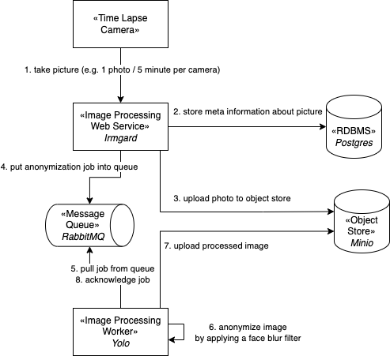

# Kubernetes Training Exam

The idea of the exam is to confront you with a real-world scenario and challenge your Kubernetes knowledge. However, the idea of the training is to provide you with essential Kubernetes basics; enough to enable you on your personal learning path beyond the tutorial. Therefore, you need to research Kubernetes related topics beyond the training material to complete the exam, perfectly.

The exam is passed if the anonymization system works and essential Kubernetes best practices are used. Using a `Deployment` where a `StatefulSet` should be used is a violation of a best practice, for example.#

## Context

A timelapse camera produces a stream of images. There number of timelapse cameras varies as timelapse projects have a limited lifetime. In gernal the business is growing, so more and more cameras are operated, simultaneously. This leads to a growing stream of incoming images.

For each timelapse project, eventually a timelapse video is produced, eventually.

The challenge is that each images captured by a camera may depict people and in particular their faces. In order protect their privacy, identities must be obfuscated. This is achieved by detecting faces and applying a blur filter to the corresponding region in the image.

## Given

The software of the anonymization system is given. Your mission is to generate an operational model for Kubernetes and run the system in a Kubernetes cluster.

The system is structured as described in the following:

1. **Image Processing Webservice** accepting HTTP POST requests to store and process incoming images. 

1. A relational database for the image processing webservice.

1. An object store to store and retrieve images.

1. A message queue to achieve an asynchronous communication between the web service and its workers establishing a loose coupling for image processing.

1. **Image Anonymizer** retrieving, blurring and uploading images.

1. **Examplary Images**. Images to be anonymized.

### Image Processing Webservice

Imgard, the image processing webservice provides an HTTP endpoint that can be used to post new images and thus feed them into the anonymization service.

* Incoming images are stored in an input bucket. A bucket of an object store is similar to a directory in a filesystem. However, the object store does not provide a filesystem and thus the term *bucket* is used.
* Information about the image is stored in a relational database. This allows retrieving images with the power of SQL queries. A photo gallery for each timelapse project could be implemented, for example.
* The task to perform the anonymization is written to a message queue (RabbitMQ) which, in turn, triggers a worker system to perform the face recognition, face blurring as well as writing the resulting image into an output bucket in the object store. Each message contains a URI reference to the image to be processed.

**GitHub**: https://github.com/fischerjulian/irmgard

**DockerHub**: https://hub.docker.com/r/fischerjulian/irmgard

### Image Anonymizer

Given is the source code, `Dockerfile` and container image providing a script which reads a file from a defined path and writes it to a defined output file to another given path.

* Listen for messages in the worker message queue.
* Process incoming anonymization jobs.
  * Retrieve image from object store
  * Perform object recognition and apply face blur filter.
  * Upload processed image to the output bucket.
  * Acknowledge the job message to confirm its successful processing. This ensures re-processing of failed processing attempts.

**GitHub**: https://github.com/fischerjulian/facerecognition-yolo

**DockerHub**: https://hub.docker.com/r/fischerjulian/facerecognition-yolo

## Exercise

Use Kubernetes to set up the distributed anyonmization system.

You are free to use any Kubernetes cluster at your disposal. 

**Hint:** Minikube [1] is a well known technology for local development.

### Message Queue
Setup a message queue using **RabbitMQ**.
  * Minimum: 1 replica
  * Extra: 3 replicas
    * Modify the RabbitMQ setup so that it provides redundancy.
      * Investigate how the loss of a RabbitMQ pod affects the message queue. Can you realize a system setup that survives the failure of indivdual pods without loosing messages?
      * Investigate how the redundancy affects the RabbitMQ's performance. Does a scale-out to 3 replicas also increase the number of requests per time unit the message queue is able to process?

### Image Processing Webservice
Set up the **image processing web service**.
  * Scale the webservice horizontally and explain what happens.
* Set up a relational database to store data of the Image Processing Webservice. 
  * Minimum: 1 replica
    * Demonstrate the failure of the database pod and explain what happens including the impact on the anonomization system's availability.
  * Preferrable: 3 replicas
  * Extra: Describe how the failure of a web service pod affects the database.  

### Image Processing Worker

Set up workers that will listen to the message queue and process incoming images.

### Object Store

Set up a minio object store and use it to store
  * incoming images (`input` bucket)
  * convertes images (`output` bucket)

### Extra: Logging with Fluentd and OpenSearch

Set up Fluentd [3] and OpenSearch [4] to collect logs from all pods.

Demonstrate how OpenSearch can be used to filter logs, e.g. by selecting all logs from the image processing web services including logs from its relational database.

### Extra: Resolve TODOs from the Source Code Repositories

The provided source code for both the *image processing web service (Irmgard)* as well as the *image processing worker (Yolo)* contain source comments marked as `TODO`s.

Resolve these TODOs. This requires code modification and thus building new container images. Upload your container images to your container registry. 

**Hint**: You can create a free account at DockerHub [2] which is also
the default container registry in Minikube. Hence, there is no configuration necessary to use the registry.

## More Hints

Have a look at the Github repositories. You may find
  * Readme files with additional information including how the application is started as well as how the corresponding container image is created.
  * Source code providing additional information on how exactly the system works.
  * `Dockerfile` providing information how the container image is build.

There are container images for both the image processing web service as well as the image processing worker. This provides you with a fallback in case you run into trouble with building your own container images. This may affect graduation but you can still pass the exam.

**If you are a student** and this is an official lecture to you (in contrast to online learners), maintaining a timesheet with relation to the lecture's effort as described in the module description may help to manage your own time spending.

## Exam Presentation

In the exam you have the opportunity to demonstrate the anynomization system and explain the challenges you have been facing, what you have learned and how you solved them. The most important outcome of the entire tutorial is your understanding of the Kubernetes technology. It is not about the `YAML` files or the system, it's about your progress. Therefore, the more you can demonstrate your learnings and understanding, the more likely a positive graduation will be.

Here is an examplary outline of an exam:

* Demonstrate the functioning of the anonymization system by posting images and showing the corresponding blurred image variants.
* Explain how the system works by elaborating which components exist and how the interact.
* Explain what you have done to run the system in Kubernetes.
  * Explain challenges, learnings and solutions.
  * For each component of the system explain your decision which Kubernetes resource has been used to run it.
* In case you have processed TODO in the source code of components
  * explain your changes and why you consider them to be improvements.
  * explain how you build the corresponding container images and what you had to do in order to use them.
* Explain how the system can be scaled if more timelapse cameras are added and thus more images need to be processed per time unit.
  * For each component explain how the component may be affected by a growing photo stream. 
    * Explain what options to scale the component exist. If scaling is to complicated at least try to explain the challenge.
  * Explain how data services such as PostgreSQL and RabbitMQ can be scaled.
    * For PostgreSQL refer to the tutorial's PostgreSQL chapter as well as the PostgreSQL documentation.
    * For RabbitMQ study the data service manual or conduct your own online research.
  * If possible, demonstrate how the component is scaled.
* Explain the system's robustness.
  * Explain how each component is affected by failing pods.
    * How many pods of a given component may fail simultaneously?
    * What happens during pod failure? Is there impact on the system availability?
  * Demonstrate the self-healing of failed pods by simulating failed pods.
    * Explain the system behavior and failure impact.
  * For data services again make your own research but keep it simple.
    * Try to explain the different challenges for PostgreSQL and RabbitMQ when it comes to tolerating failing pods. Pointing out basic problems is sufficient.
* Demonstrate the release of a new product version
  * Note: This demonstration use case is mostly relevant if you processed source code TODOs as mentioned above.
  * Optionally, include a change of the database schema.
  * Explain the update procedure along with challenges and solutions.

Not all of the above use cases have to be demonstrated. The more you can cover, the better. 

Have fun!

## Sources and Links

1. Minikube, https://minikube.sigs.k8s.io/
2. DockerHub, https://hub.docker.com/
3. Fluentd, https://www.fluentd.org/
4. OpenSearch, https://opensearch.org/